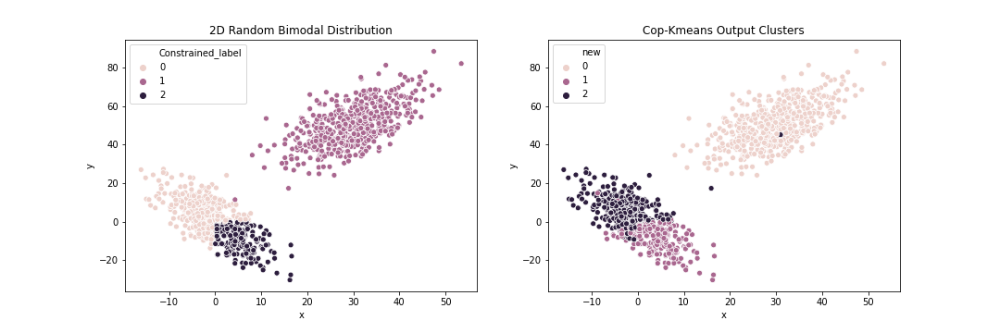

# Constrained Clustering

Krishna Teja

---

# Problem Statement

**Stated as** : Select a portion of the data as separate cluster and continue clustering

<!-- Image from output of the data -->

---

# Random Data Generation

1. Generate 2D Multivariate normal data
2. Establish GroundTruth based on the desired conditions ( x>0 & y<0 )
3. Use Ground truth for constraint generation or evaluate Performance Metrics

# Metrics 

1. NMI
2. Rand Score

---

# Existing Literature

<!-- Multiple papers suggesting the implementations being done in the past and fwe Dee plearning pulciations are present too-->

---

# Interesting Algorithms

1. Cop-Kmeans (Constrained KMeans)
2. PCKMeans (Pairwise Constrained KMeans) & Others
3. Preidentify and Kmeans

---

# References 

1. Cop-Kmeans (Constrained KMeans) [[1]]('https://www.cs.cmu.edu/~./dgovinda/pdf/icml-2001.pdf')
2. PCKMeans (Pairwise Constrained KMeans) & Others [[2]]('https://www.researchgate.net/publication/286812684_Semi-supervised_clustering_with_pairwise_and_size_constraints?enrichId=rgreq-0d2b185b378046c7f808e88656061d70-XXX&enrichSource=Y292ZXJQYWdlOzI4NjgxMjY4NDtBUzozMjI3OTM4NTIzNDIyNzVAMTQ1Mzk3MTQ1OTkzNg%3D%3D&el=1_x_3&_esc=publicationCoverPdf')
3. PreIdentify and Kmeans

---

# Implemented Algorithms

1. Cop-Kmeans (Constrained KMeans)
2. PreIdentify and Kmeans

---

# Cop-KMeans - Implemented Algorithms(contd.)

<!-- </img> -->

---

# Cop-KMeans - Implemented Algorithms(contd.)

### Steps Involved : 
1. Generate all Must-Link and Cannot-Link constraints from Ground Truth of the data
2. ML - datapoints in one cluster
3. CL - datapoints from different cluster
4. When the whole GT is known, every combination can be achieved
5. Transitive closure should be oberved when making constraints
6. In reality, we might know less than 5% of the GT
7. So we take these available info from GT(1%) and make them into constraints
8. Run the algorithm as mentioned where constraints are not violated along with finding the closest cluster

---

# PreIdentify-KMeans - Implemented Algorithms(contd.)

### Steps Involved : 
1. Pre-label all the data points with the desired cluster tag
2. Find the centroid of that specific cluster
3. Find the remaning centroids on all of the remaining data based on distance
4. Converge when the centroids do not move - as usual

--- 

# Results : Cop-Kmeans
<!--Left hand side -->

 * NMI ~ 1.0 (3% of random constraints)

---
<!--Right hand side -->
# Results : PreIdentify-Kmeans

* NMI = 0.782
---
# Limitations

### Cop-Kmeans
1. Cop-KMeans is time consuming
2. Sometimes, does not converge after processing for a long time

### PreIdentify-Kmeans
1. Pre-Idenifying the data points with their labels is exactly not part of unsupervised/semi-supervised for that cluster
2. There is no clustering happening in the selected portion, just finding a centroid
3. Always need labels for the special cluster
--- 

# Thank you
https://github.com/krishnatejak2/customKmeans